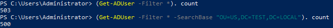

# ActiveDirectory
## The second largest heading
###### The smallest heading


Get user count
```
(Get-ADUser -Filter *). count
```




This site was built using [GitHub Pages](https://img-prod-cms-rt-microsoft-com.akamaized.net/cms/api/am/imageFileData/RE4CFyx?ver=25c5&q=90&m=6&h=157&w=279&b=%23FFFFFFFF&l=f&o=t&x=839&y=615&aim=true).

[Contribution guidelines for this project](docs/CONTRIBUTING.md)
